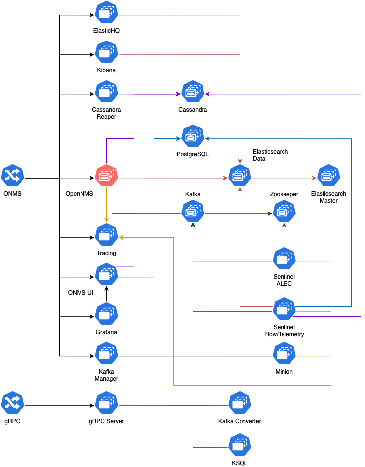

# OpenNMS Drift in Kubernetes

OpenNMS Drift deployment in [Kubernetes](https://kubernetes.io/).



For learning purposes, `Helm` charts and `operators` are avoided for this solution on the main components, except the Ingress Controller and Cert-Manager. In the future, that might change to take advantage of these technologies.

This deployment contains a fully distributed version of all OpenNMS components and features, with high availability in mind when possible.

There are some additional features available in this particular solution, like [Hasura](https://hasura.io/), [Cassandra Reaper](http://cassandra-reaper.io/) and [Kafka Manager](https://github.com/yahoo/CMAK) (or `CMAK`). All of them are optional (added for learning purposes).

## Minimum Requirements

* Install the [kubectl](https://kubernetes.io/docs/tasks/tools/install-kubectl/) binary.
* Install the [kustomize](https://kustomize.io/) binary on your machine [Optional, but good to have for troubleshooting]

> **NOTE**: Depending on the chosen platform, additional requirements might be needed. Check the respective `README` files for more information.

## Cluster Configuration

Proceed with the preferred cluster technology:

* Using [Kops](README.kops.md) on AWS.
* Using [EKS](README.eks.md) on AWS.
* Using [GKE](README.gce.md) on Google Compute Platform.
* Using [AKS](README.azure.md) on Microsoft Azure.
* Using [Minikube](README.minikube.md) on your machine (with restrictions).

## Deployment

To facilitate the process, everything is done through `kustomize`.

To update the default settings, find the `common-settings` under `configMapGenerator` inside [kustomization.yaml](manifests/kustomization.yaml).

To update the default passwords, find the `onms-passwords` under `secretGenerator` inside [kustomization.yaml](manifests/kustomization.yaml).

Each cluster technology explains how to deploy the manifests.

As part of the deployment, some complementary RBAC permissions will be added if there is a need for adding operators and/or administrators to the OpenNMS namespace. Check [namespace.yaml](manifests/namespace.yaml) for more details.

Use the following to check whether or not all the resources have been created:

```bash
kubectl get all --namespace opennms
```

## Minion

This deployment already contains Minions inside the opennms namespace for monitoring devices within the cluster. To have Minions outside the Kubernetes cluster, they should use the following resources to connect to OpenNMS and the dependent applications.

For instance, for `AWS` using the domain `aws.agalue.net`, the resources should be:

* OpenNMS Core: `https://onms.aws.agalue.net/opennms`
* GRPC: `grpc.aws.agalue.net:443`

For example:

```bash
docker run -it --name minion \
 -e OPENNMS_HTTP_USER=admin \
 -e OPENNMS_HTTP_PASS=admin \
 -p 8201:8201 \
 -p 1514:1514/udp \
 -p 1162:1162/udp \
 -p 8877:8877/udp \
 -p 11019:11019 \
 -v $(pwd)/minion.yaml:/opt/minion/minion-config.yaml \
 -v $(pwd)/minion.properties:/opt/minion-etc-overlay/custom.system.properties \
 opennms/minion:27.1.1 -c
```

> **IMPORTANT**: Make sure to use the same version as OpenNMS. The above contemplates using a custom content for the `INSTANCE_ID` (see [minion.properties](minion.properties)). Make sure it matches the content of [kustomization.yaml](manifests/kustomization.yaml).

> **WARNING**: Make sure to use your own Domain and Location, and use the same version tag as the OpenNMS manifests.

> **CRITICAL**: If you're planning to use the UDP Listeners (Telemetry, Flows, SNMP Traps, Syslog), and you're going to use Docker, make sure to do it on a server running Linux, not a VM, Docker for Mac or Docker for Windows, because of the reasons explained [here](https://opennms.discourse.group/t/running-in-docker-and-receiving-flows-traps-or-syslog-messages-over-udp/1103).

## Users Resources

* OpenNMS Core: `https://onms.aws.agalue.net/opennms/` (for administrative tasks)
* OpenNMS UI: `https://onmsui.aws.agalue.net/opennms/` (for users/operators)
* Grafana: `https://grafana.aws.agalue.net/`
* Kibana: `https://kibana.aws.agalue.net/` (remember to enable monitoring)
* Kafka Manager: `https://kafka-manager.aws.agalue.net/` (make sure to register the cluster using `zookeeper.opennms.svc.cluster.local:2181/kafka` for the `Cluster Zookeeper Hosts`, and enable SASL similar to all the clients)
* Hasura GraphQL API: `https://hasura.aws.agalue.net/v1alpha1/graphql`
* Hasura GraphQL Console: `https://hasura.aws.agalue.net/console`
* Jaeger UI: `https://tracing.aws.agalue.net/`
* Cassandra Reaper: `https://cassandra-reaper.aws.agalue.net/webui/`

> **WARNING**: Make sure to use your own Domain.

## Future Enhancements

* Add [Network Policies](https://kubernetes.io/docs/concepts/services-networking/network-policies/) to control the communication between components (for example, only OpenNMS needs access to PostgreSQL and Cassandra; other components should not access those resources). A network manager like [Calico](https://www.projectcalico.org) is required.
* Design a solution to manage OpenNMS Configuration files (the `/opt/opennms/etc` directory), or use an existing one like [ksync](https://ksync.github.io/ksync/).
* Investigate how to provide support for `HorizontalPodAutoscaler` for the data clusters like Cassandra, Kafka, and Elasticsearch. Check [here](https://github.com/kubernetes/kops/blob/master/docs/horizontal_pod_autoscaling.md) for more information. However, using operators seems more feasible due to the complexities when expanding/shrinking these kinds of applications.
* Add support for Cluster Autoscaler. Check what `kops` offers in this regard.
* Add support for monitoring through [Prometheus](https://prometheus.io) using [Prometheus Operator](https://coreos.com/operators/prometheus/docs/latest/). Expose the UI (including Grafana) through the Ingress controller.
* Expose the Kubernetes Dashboard through the Ingress controller.
* Design a solution to handle Cassandra's scale and decommission of nodes; or investigate the existing operators.
* Explore a `PostgreSQL` solution like [Spilo/Patroni](https://patroni.readthedocs.io/en/latest/) using their [Postgres Operator](https://postgres-operator.readthedocs.io/en/latest/), to understand how to build a HA Postgres within K8s. Alternatively, we might consider the [Crunchy Data Operator](https://crunchydata.github.io/postgres-operator/stable/)
* Explore a `Kafka` solution like [Strimzi](https://strimzi.io/), an operator that supports encryption and authentication.
* Explore [Helm](https://helm.sh), and potentially add support for it.
